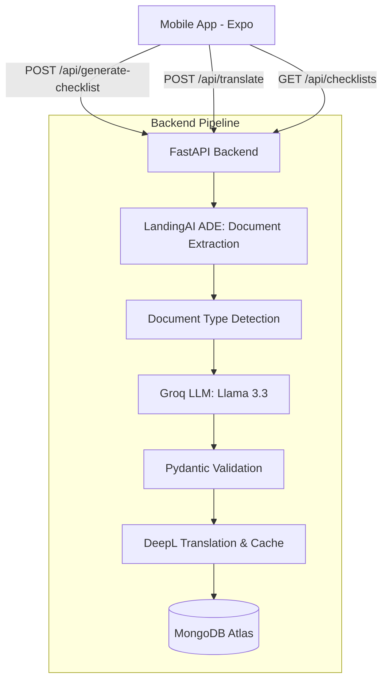

# Safety Checklist AI

[](https://github.com/Anish06-crypto/safety-checklist-ai/actions/workflows/ci.yml)

An AI-driven safety inspection system for the offshore energy industry. This project demonstrates the automated extraction of structured DROPS (Dropped Object Prevention Scheme) checklists from unstructured PDF procedures, real-time translation for field crews, and a mobile-first inspection interface.

## 🚀 Overview

Safety Checklist AI addresses the manual overhead and compliance risks in offshore safety inspections. By leveraging LLMs and specialized document parsing, it transforms complex regulatory documents into actionable, multilingual digital checklists.

### Key Features
- **LandingAI ADE Integration:** Uses Agentic Document Extraction (ADE) to transform complex PDFs into structured Markdown, preserving tables, charts, and hierarchical data.
- **AI-Powered Generation:** Leverages Groq (Llama 3.3 70B) to generate safety-critical checklist items with precise severity classification.
- **Visual Grounding:** Links inspection items to specific coordinates in the source document for evidence verification.
- **Real-Time Translation:** On-the-fly translation into 10+ languages (Norwegian, French, Arabic, etc.) via DeepL.
- **Mobile-First UX:** A React Native/Expo application designed for handheld use in the field.

## 🏗 Architecture & Pipeline



## 🛠 Tech Stack

### Backend
- **Framework:** FastAPI (Python 3.11+)
- **Extraction Engine:** LandingAI ADE (Agentic Document Extraction)
- **LLM:** Groq API (Llama 3.3 70B Versatile)
- **Translation:** DeepL API
- **Database:** MongoDB Atlas
- **Deployment:** Render

### Mobile
- **Framework:** React Native (Expo SDK 52)
- **Language:** TypeScript
- **State Management:** Zustand
- **Navigation:** Expo Router (File-based)

## 📁 Project Structure

```text
safety-checklist-ai/
├── backend/                # FastAPI Application
│   ├── services/           # Extraction, Generation, Translation logic
│   ├── models/             # Pydantic schemas
│   ├── database/           # MongoDB configuration
│   └── main.py             # API Entry point
├── mobile/                 # React Native / Expo App
│   ├── app/                # Expo Router screens
│   ├── components/         # Shared UI components
│   ├── store/              # Zustand state management
│   └── lib/                # API client and utilities
└── PLAN.md                 # Detailed implementation roadmap
```

## ⚙️ Getting Started

### Backend Setup
1. Navigate to the backend directory:
   ```bash
   cd backend
   ```
2. Create and activate a virtual environment:
   ```bash
   python -m venv venv
   source venv/bin/activate  # On Windows: venv\Scripts\activate
   ```
3. Install dependencies:
   ```bash
   pip install -r requirements.txt
   ```
4. Create a `.env` file based on `.env.example` and add your API keys:
   ```env
   GROQ_API_KEY=your_key
   DEEPL_API_KEY=your_key
   MONGODB_URI=your_mongodb_connection_string
   ```
5. Run the server:
   ```bash
   uvicorn main:app --reload
   ```

### Mobile Setup
1. Navigate to the mobile directory:
   ```bash
   cd mobile
   ```
2. Install dependencies:
   ```bash
   npm install
   ```
3. Start the Expo development server:
   ```bash
   npx expo start
   ```

## 📊 DROPS Severity Logic
The system automatically classifies inspection items into three zones based on mass and height thresholds:
- **🔴 CRITICAL:** High risk of fatality (e.g., >10kg at >1.5m).
- **🟡 MAJOR:** Lost Time Incident (LTI) risk.
- **🟢 MINOR:** Medical Treatment / First Aid risk.

## 🧪 Testing

### Backend Tests
The backend uses `pytest` for unit and integration testing.
```bash
cd backend
pytest
```
Key test suites include:
- `test_extractor.py`: Validates two-path PDF parsing logic.
- `test_generator.py`: Verifies LLM prompt efficacy and JSON schema adherence.
- `test_translator.py`: Tests DeepL integration and caching.

### Mobile Tests
The mobile app uses standard React Native testing patterns (Jest + React Native Testing Library).
```bash
cd mobile
npm test
```

## 🌐 Translation Coverage
The project currently supports:
- **Primary:** English (EN), Norwegian (NB), French (FR).
- **Secondary:** Arabic (AR), Polish (PL), Indonesian (ID), Spanish (ES).

## 📄 Demo Documents
The system is optimized for:
1. **DROPS Recommended Practice 2017**: Primary source for checklist generation logic.
2. **HSE Thorough Examination of Lifting Equipment (INDG422)**: Used for secondary regulatory context.

## ☁️ Deployment

### Backend (Render)
The backend is configured for deployment on Render via `render.yaml`. It requires the following environment variables:
- `GROQ_API_KEY`
- `DEEPL_API_KEY`
- `MONGODB_URI`

### Mobile (Expo)
The mobile app can be published via Expo EAS:
```bash
cd mobile
eas build --platform ios # or android
```

---

## 📜 License
This project is developed for a safety checklist generation system. Demo documents used (DROPS RP 2017) are used under their respective copyright-free or open-government licenses.
