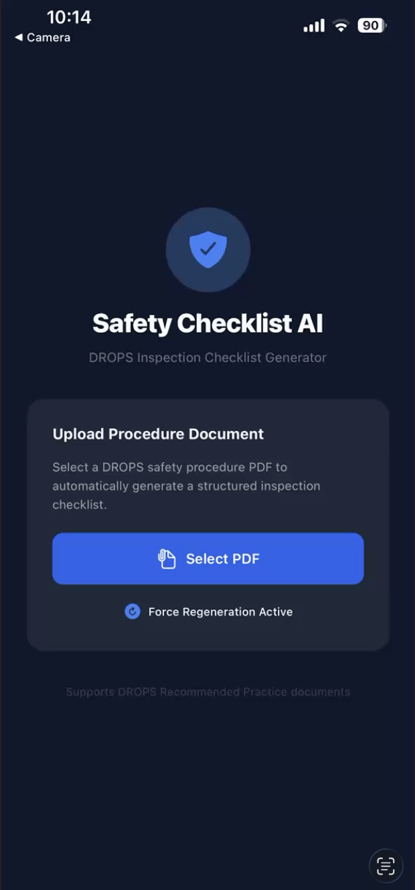
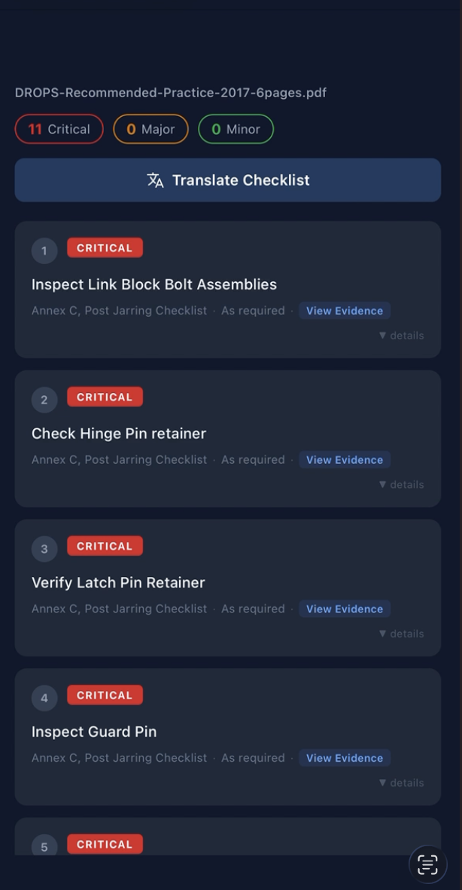
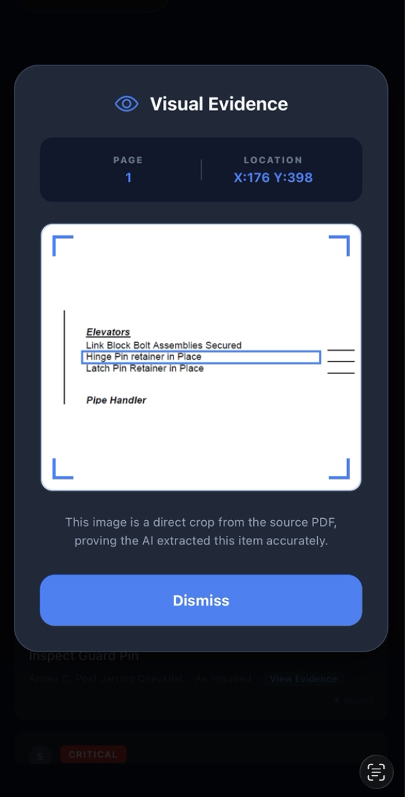
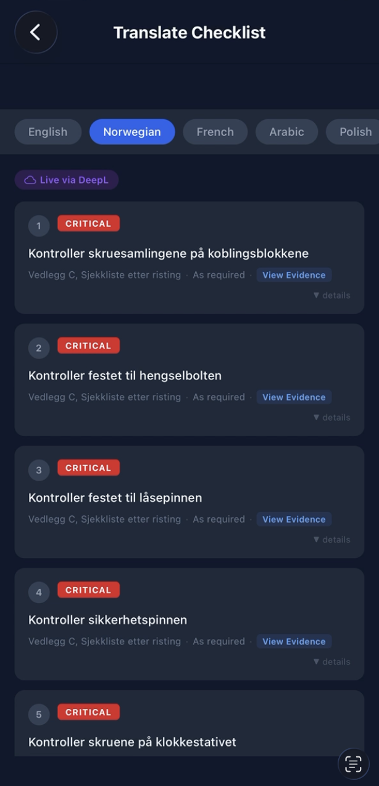
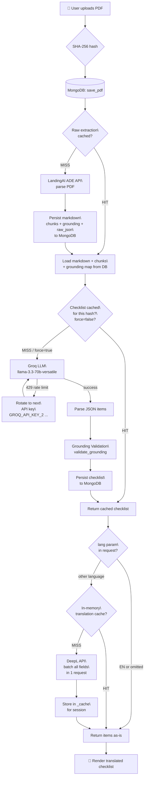
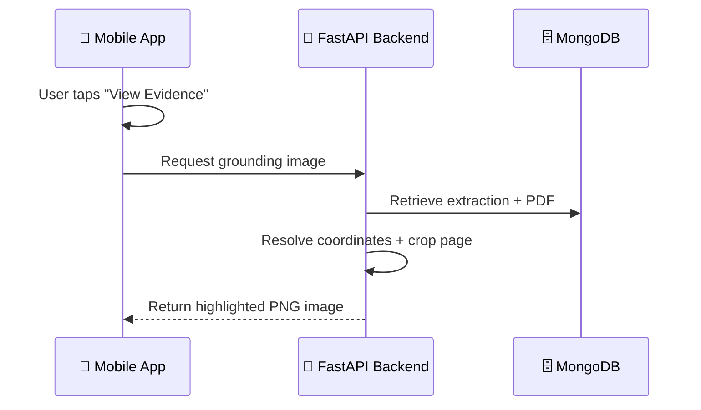

# Safety Checklist AI

An end-to-end document intelligence and multilingual safety checklist generation system for the offshore energy industry.

Safety Checklist AI investigates how AI-driven document extraction, grounding systems, and multilingual NLP workflows can transform complex technical safety procedures into verifiable digital inspection checklists for handheld field use.

---

## 🚀 Problem Statement

Technical safety procedures in the offshore energy industry are commonly distributed as semi-structured PDFs containing:

* Tables and matrix-based inspection logic
* Layout-dependent instructions
* Screenshots and diagrams
* Hierarchical checklist structures
* Mixed formatting and pseudo-table rendering

Naïvely extracting raw PDF text and passing it directly to an LLM proved unreliable because critical procedural context, structural relationships, and evidence provenance were frequently lost or misinterpreted.

This project was built to investigate how document-intelligence pipelines, grounded extraction, and multilingual LLM workflows could be combined to create auditable, safety-critical digital checklists from real DROPS documentation.

---

## 📸 App Preview

|                   1. Upload & Ingestion                  |                  2. AI-Generated Checklist                 |
| :------------------------------------------------------: | :--------------------------------------------------------: |
|  |  |
|             *Upload any DROPS procedure PDF*             |           *Items extracted with severity levels*           |

|                      3. Visual Grounding                     |                    4. Real-Time Translation                    |
| :----------------------------------------------------------: | :------------------------------------------------------------: |
|  |  |
|         *Direct PDF crops for evidence verification*         |                *Seamless translation via DeepL*                |

---

## 🔍 Why Standard PDF → LLM Pipelines Fail

During early experimentation, a naïve PDF-to-LLM pipeline was tested using conventional text extraction approaches.

Several major issues emerged:

* Table row/column relationships were flattened into plain text
* Screenshots and diagrams lost surrounding procedural context
* Layout hierarchy was destroyed during extraction
* Checklist provenance could not be verified visually
* Important safety logic embedded in tables was frequently missed
* Hallucinated grounding references reduced trustworthiness

These findings led to the investigation of document-intelligence approaches capable of preserving structural relationships and visual grounding.

---

# 🧠 Core Features

## 📄 Agentic Document Extraction (ADE)

Uses LandingAI ADE to convert complex safety PDFs into structured Markdown while preserving:

* Tables
* Hierarchical headings
* Bounding boxes
* Chunk relationships
* Cell-level identifiers
* Grounding metadata

---

## 🤖 AI-Powered Checklist Generation

Uses Groq-hosted Llama 3.3 70B to generate structured inspection checklists from extracted document content.

The system:

* Extracts both prose-based and table-based checklist items
* Preserves source provenance
* Generates severity classifications
* Produces structured JSON outputs
* Supports grounding-aware checklist generation

---

## 🎯 Visual Grounding & Evidence Verification

Every generated checklist item can reference its original source location within the PDF.

The system supports:

* Chunk-level grounding
* Cell-level grounding
* Bounding-box cropping
* Visual evidence overlays
* Pixel-precise table cell references

This enables inspection personnel to verify exactly where checklist information originated.

---

## 🌍 Real-Time Multilingual Translation

Checklist outputs can be translated into multiple languages for global offshore deployment.

Supported languages include:

* English
* Norwegian
* French
* Arabic
* Polish
* Indonesian
* Spanish
* Portuguese (Brazil)
* Dutch
* Romanian

Translations are batch-processed using DeepL for lower latency and reduced API overhead.

---

## 📱 Mobile-First Field Interface

A React Native / Expo application designed for handheld inspection workflows.

Features include:

* PDF upload
* Checklist review
* Evidence verification
* Real-time translation
* Mobile-optimised UI

---

# 🏗 End-to-End Pipeline



---

# ⚙️ Pipeline Breakdown

## Stage 1 — Document Ingestion

| Step        | Detail                                                    |
| ----------- | --------------------------------------------------------- |
| Upload      | Mobile app POSTs PDF via multipart form                   |
| Hashing     | SHA-256 → short hash used as document identity key        |
| Persistence | Raw PDF bytes stored in MongoDB for later grounding crops |

---

## Stage 2 — Structured Extraction

The extraction cache is always checked before invoking ADE.

| Scenario   | Behaviour                                                                   |
| ---------- | --------------------------------------------------------------------------- |
| Cache HIT  | Loads markdown, chunks, grounding map, and raw extraction data from MongoDB |
| Cache MISS | Calls LandingAI ADE API and persists structured extraction results          |

### Stored Extraction Data

* `markdown` — structured markdown with chunk anchors and table-cell identifiers
* `chunks` — top-level extraction chunks with grounding metadata
* `grounding` — flat ID → bounding box mapping for both chunk and cell references
* `raw_json` — full ADE response for debugging and analysis

---

## Stage 3 — Checklist Generation

### Model

* Primary: `llama-3.3-70b-versatile`
* Fallback: `llama-3.1-8b-instant`

### Prompt Constraints

The LLM is instructed to:

1. Extract checklist items from both prose and tables
2. Use cell-level IDs for table-derived items
3. Use chunk-level IDs for prose-derived items
4. Preserve provenance references for visual grounding

---

## Stage 4 — Grounding Validation

A validation layer runs before checklist persistence.

Validation steps:

```text
For each checklist item:
1. Validate chunk_id against cell map
2. Fallback to chunk map lookup
3. Remove invalid IDs
4. Extract semantic keywords
5. Compare keywords against source text
6. Reject semantically mismatched grounding
```

This prevents hallucinated provenance references from reaching the UI.

---

## Stage 5 — Visual Evidence Generation

The system can generate cropped evidence images directly from the original PDF.

### Grounding Flow



### Coordinate Resolution

* Bounding boxes are stored in normalised coordinates `[0.0 - 1.0]`
* Coordinates are converted to absolute page pixels using PyMuPDF
* Cell-level references provide significantly tighter crops than top-level chunk grounding

---

## Stage 6 — Translation Pipeline

### Translation Strategy

All translatable checklist fields are batched into a single DeepL request.

Example:

```text
8 checklist items × 4 fields = 32 strings → 1 API call
```

This significantly reduces translation latency compared to sequential translation requests.

### Translated Fields

* `action`
* `acceptance_criteria`
* `failure_criteria`
* `source_section`

### Preserved Fields

* `severity`
* `chunk_id`
* `id`
* `frequency`

---

# 🧩 Key Engineering Challenges

## 1. Naïve PDF Extraction Failures

Initial PDF-to-LLM approaches failed because document structure, tables, and visual relationships were lost during extraction.

---

## 2. Pseudo-Table Rendering

One DROPS checklist section visually resembled a table but was actually rendered in the PDF as text with horizontal rules rather than as a native table object.

This caused different extraction behaviour compared to adjacent checklist sections.

---

## 3. Grounding Granularity

Top-level chunk grounding produced overly broad evidence regions.

To improve precision, a two-tier grounding architecture was implemented:

* UUID chunk references
* Cell-level table references

This enabled significantly more precise visual evidence crops.

---

## 4. Hallucinated Provenance

LLM-generated grounding IDs occasionally referenced semantically unrelated content.

A backend validation layer was introduced to reject invalid or mismatched provenance references before persistence.

---

## 5. Translation Performance

Sequential translation requests introduced unnecessary latency.

Batching all fields into a single request significantly reduced translation overhead.

---

# 🏛 Data Architecture

```text
MongoDB Collections:
├── pdfs
├── raw_extractions
└── checklists
```

---

# 📐 Key Design Decisions

| Decision                                                 | Rationale                                             |
| -------------------------------------------------------- | ----------------------------------------------------- |
| Cache extraction independently of checklist regeneration | Avoids expensive ADE calls during prompt iteration    |
| Two-tier ID system (UUID + cell IDs)                     | Enables pixel-precise table grounding                 |
| Grounding validation layer                               | Prevents hallucinated provenance from reaching the UI |
| Async cell-level grounding fetch                         | Keeps initial checklist load lightweight              |
| API key rotation                                         | Handles free-tier throughput limitations              |
| Translation batching                                     | Reduces latency and API overhead                      |
| Bounding-box coordinate normalisation                    | Enables resolution-independent grounding              |
| Evidence overlays                                        | Improves auditability and inspection trust            |

---

# 📊 Operational Notes

| Metric                           | Value               |
| -------------------------------- | ------------------- |
| ADE cost per sample document     | 6 Pages = 18 Creds  |
| Supported languages              | en, nr, esp, fr,etc.|
| Average translation request size | 32 strings          |
| Grounding granularity            | Chunk + cell level  |
| Mobile deployment                | React Native / Expo |
| Backend deployment               | Render              |

---

# 🛠 Tech Stack

## Backend

* FastAPI
* Python 3.11+
* LandingAI ADE
* Groq API
* DeepL API
* MongoDB Atlas
* PyMuPDF

---

## Mobile

* React Native
* Expo
* TypeScript
* Zustand
* Expo Router

---

## Infrastructure

* Render
* GitHub Actions
* Environment-based secrets management

---

# 🧪 Testing

The backend uses `pytest` for unit and integration testing.

Key test areas include:

* Extraction pipeline behaviour
* Grounding validation
* Translation batching
* Checklist generation
* Cache behaviour

CI workflows support development without consuming ADE credits by routing extraction through a fallback path during tests.

---

# ⚠️ Current Limitations

* The translation cache is currently process-local and resets after redeployment
* Latency benchmarking has not yet been formally measured
* Authentication / RBAC layers are not yet implemented
* The system has primarily been tested against DROPS documentation formats
* Some visually table-like PDF sections may still require hybrid extraction logic
* The system is deployed on Render's free tier, which has limitations on CPU, memory, disk space and 50 second start up time for initial API call. 
* Groq free tier allows 12K context tokens per call on llama3.3-70b-instruct model which limits the size of documents that can be processed.  

---

# 🌐 Demo Links

* [Backend API Documentation](https://safety-checklist-ai.onrender.com/docs)
* [Mobile App Demo](https://expo.dev/preview/update?message=Added+Grouding+Overlay+and+chunk+detection&updateRuntimeVersion=1.0.0&createdAt=2026-05-11T04%3A43%3A28.361Z&slug=exp&projectId=b11b342f-399b-462c-9f32-453b93ca348f&group=1a9b6a97-25b2-4310-9538-be71ae913d48)

---

# 📄 Demo Documents

The system was primarily tested against publicly available DROPS Recommended Practice documentation.

Additional regulatory-style documents were used to evaluate extraction robustness and checklist generation behaviour.

---

# ⚖️ Safety-Critical Considerations

This project intentionally avoids blindly trusting LLM outputs.

Key safeguards include:

* Grounding validation before persistence
* Source provenance preservation
* Visual evidence verification
* Structured extraction over raw OCR text
* Bounding-box traceability
* Invalid grounding rejection

The goal is to improve auditability and operator trust when generating inspection workflows from technical documentation.

---

# 📜 License

This repository is intended as a technical demonstration and research prototype for AI-assisted safety checklist generation.

Publicly available DROPS documentation is used under its respective licensing and usage terms.
